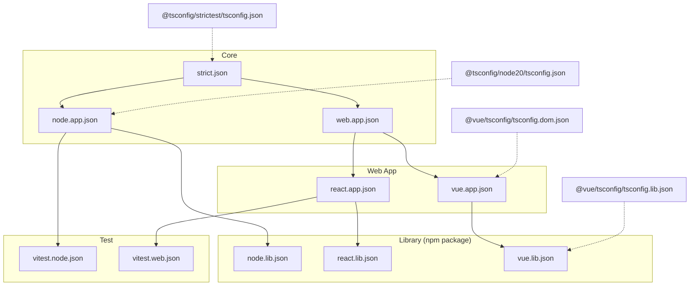

# Dependency Graph

Dependency relationships between the presets of `@tofrankie/tsconfig`.

- **`A --> B`** means `A` is included in `B`'s `extends`.
- **`A -.-> B`** means `B` directly extends external npm preset `A`.
